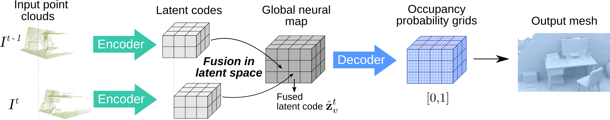

# NeuralBlox: Real-Time Neural Representation Fusion for Robust Volumetric Mapping
This repository contains **NeuralBlox**, our framework for volumetric mapping in latent neural representation space. 



# Table of Contents
* [Paper](#Paper)
* [Installation](#Installation)
* [Demo](#Demo)

## Paper
If you find our code or paper useful, please consider citing us:

* Stefan Lionar\*, Lukas Schmid\*, Cesar Cadena, Roland Siegwart, and Andrei Cramariuc. "**NeuralBlox: Real-Time Neural Representation Fusion for Robust Volumetric Mapping**", International Conference on 3D Vision (3DV), pp. 1279-1289, 2021. (\* equal contribution)
  \[ [IEEE](https://ieeexplore.ieee.org/abstract/document/9665902) | [ArXiv](https://arxiv.org/abs/2110.09415) | [Supplementary](https://polybox.ethz.ch/index.php/s/PFelrDRddduLguP/download) \]
  ```bibtex
  @inproceedings{lionar2021neuralblox,
   title = {NeuralBlox: Real-Time Neural Representation Fusion for Robust Volumetric Mapping},
   author={Stefan Lionar, Lukas Schmid, Cesar Cadena, Roland Siegwart, Andrei Cramariuc},
   booktitle={2021 International Conference on 3D Vision (3DV)}, 
   year={2021},
   pages={1279-1289},
   doi={10.1109/3DV53792.2021.00135}}
  }
  ```

## Installation

```
conda env create -f environment.yaml
conda activate neuralblox
pip install torch-scatter==2.0.4 -f https://pytorch-geometric.com/whl/torch-1.4.0+cu101.html
```
Note: Make sure torch-scatter and PyTorch have the same cuda toolkit version. If PyTorch has a different cuda toolkit version, run:
```
conda install pytorch==1.4.0 cudatoolkit=10.1 -c pytorch
```
Next, compile the extension modules.
You can do this via
```
python setup.py build_ext --inplace
```

**Optional:** For a noticeably faster inference on CPU-only settings, upgrade PyTorch and PyTorch Scatter to a newer version:

```
pip install torch==1.7.1+cu101 torchvision==0.8.2+cu101 -f https://download.pytorch.org/whl/torch_stable.html
pip install --upgrade --no-deps --force-reinstall torch-scatter==2.0.5 -f https://pytorch-geometric.com/whl/torch-1.7.1+cu101.html
```

## Demo

To generate meshes using our pretrained models and evaluation dataset, you can select several configurations below and run it.

```
python generate_sequential.py configs/fusion/pretrained/redwood_0.5voxel_demo.yaml
python generate_sequential.py configs/fusion/pretrained/redwood_1voxel_demo.yaml
python generate_sequential.py configs/fusion/pretrained/redwood_1voxel_demo_cpu.yaml --no_cuda
```
- The mesh will be generated to `out_mesh/mesh` folder.
- To add noise, change the values under `test.scene.noise` in the config files.

## Training backbone encoder and decoder

The backbone encoder and decoder mainly follow Convolutional Occupancy Networks (https://github.com/autonomousvision/convolutional_occupancy_networks) with some modifications adapted for our use case. Our pretrained model is provided in this repository.

### Dataset

#### ShapeNet
The proprocessed ShapeNet dataset is from Occupancy Networks (https://github.com/autonomousvision/occupancy_networks). You can download it (73.4 GB) by running:

```
bash scripts/download_shapenet_pc.sh
```

After that, you should have the dataset in `data/ShapeNet` folder.

### Training
To train the backbone network from scratch, run
```
python train_backbone.py configs/pointcloud/shapenet_grid24_pe.yaml
```
## Latent code fusion

The pretrained fusion network is also provided in this repository.

### Training dataset

To train from scratch, you can download our preprocessed Redwood Indoor RGBD Scan dataset by running:
```
bash scripts/download_redwood_preprocessed.sh
```

We align the gravity direction to be the same as ShapeNet ([0,1,0]) and convert the RGBD scans following ShapeNet format. 

More information about the dataset is provided here: http://redwood-data.org/indoor_lidar_rgbd/.

### Training
    
To train the fusion network from scratch, run
```
python train_fusion.py configs/fusion/train_fusion_redwood.yaml
```
Adjust the path to the encoder-decoder model in `training.backbone_file` of the .yaml file if necessary.

### Generation

```
python generate_sequential.py CONFIG.yaml
```

If you are interested in generating the meshes from other dataset, e.g., [ScanNet](https://github.com/ScanNet/ScanNet):
- Structure the dataset following the format in `demo/redwood_apartment_13k`. 
- Adjust `path`, `data_preprocessed_interval` and `intrinsics` in the config file.
- If necessary, align the dataset to have the same gravity direction as ShapeNet by adjusting `align` in the config file.

For example,
```
# ScanNet scene ID 0
python generate_sequential.py configs/fusion/pretrained/scannet_000.yaml

# ScanNet scene ID 24
python generate_sequential.py configs/fusion/pretrained/scannet_024.yaml
```
To use your own models, replace `test.model_file` (encoder-decoder) and `test.merging_model_file` (fusion network) in the config file to the path of your models.

### Evaluation

You can evaluate the predicted meshes with respect to a ground truth mesh by following the steps below:
1. Install CloudCompare
```
sudo apt install cloudcompare
```
2. Copy a ground truth mesh (no RGB information expected) to `evaluation/mesh_gt`
3. Copy prediction meshes to `evaluation/mesh_pred`
4. If the prediction mesh does not contain RGB information, such as the output from our method, run:
```
python evaluate.py
```
Else, if it contains RGB information, such as the output from Voxblox, run:
```
python evaluate.py --color_mesh
```

We provide the trimmed mesh used for the ground truth of our quantitative evaluation. It can be downloaded [here](https://drive.google.com/drive/folders/11MsRXgsNMlV1oH5sfuhKwkWSuT2odzNw?usp=share_link).


Lastly, to evaluate prediction meshes with respect to the trimmed mesh as ground truth, run:
```
python evaluate.py --demo
```

Or for colored mesh (e.g. from Voxblox):
```
python evaluate.py --demo --color_mesh
```

evaluation.csv will be generated to `evaluation` directory.

## Acknowledgement

Some parts of the code are inherited from the official repository of Convolutional Occupancy Networks (https://github.com/autonomousvision/convolutional_occupancy_networks).
